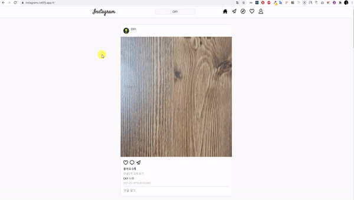
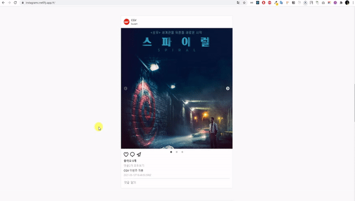

# 프로젝트명: 인스타그램(pc)

## :link: SITE LINK

### https://instagramc.netlify.app/#/

본 사이트를 이용하기 위해서는 회원가입을 하고 검색란에 CKY를 팔로잉하시면 됩니다.
무료서버로 운영되기에 첫 로딩시 다소 시간이 소요 될 수있습니다.

## :muscle: STACK


> React를 사용한 프론트 엔드 기능구현

> Styled-components를 사용한 스타일링

> GraphQL, Apollo,Prisma를 사용한 백엔드 구현

> JWT, Passport를 사용한 인증 기능구현

> heroku, netlify를 사용한 호스팅

## :large_blue_circle: 기능

✅JWT,Passport를 통한 로그인,회원가입
✅Local Storage저장으로 접속시 마다 로그인 불필요
✅작성된 포스터 게시물 보기
✅팔로잉한 유저의 포스터 게시물 보기
✅좋아요하기, 좋아요 카운트
✅댓글보기 및 작성(Modal)
✅회원검색 및 게시물 검색
✅프로필 보기
✅팔로잉, 팔로우하기
✅heroku, netlify를 통한 배포

## :red_circle: PRIVIEW





## :large_blue_circle: 설명

```
개인 블로그형 사이트 프로젝트입니다. 기본적으로 모든 포스트를 스크롤 형태로 열람 가능하며
각 포스트는 클릭시 상세 보기가 가능합니다.
개인 블로그의 초점이 맞춰져 있기 때문에 권한이 있는 관리자만 포스트 작성이 가능하며,
일반적인 회원은 회원가입을 통해서 댓글작성이 가능합니다.
포스트 작성은 CKEdit5를 이용하여 보다 손쉽게 글을 작성 하도록 하였으며 사진,동영상 저장은
AWS S3를 통하여 데이터를 관리 하도록 하였습니다.
각 포스트에 카테고리 태그를 할당하여 카테고리를 클릭시 카테고리별 포스트를 열람 가능하며,
검색기능 또한 추가하여 대소문 상관없이 포스트 제목을 통한 검색이 가능하도록 하였습니다.
로그인 후 프로필 수정을 클릭시 비밀번호 또한 변경을 가능하도록 하였습니다.
전체적으로 프론트 구성은 React와 redux, bootstrap4를 통해 구현하였으며,
이와 상호작용하는 백엔드는 Node.js의 express를 통해 구현하였습니다.
DB부분은 MongoDB의 Mongoose를 통해 보다 데이터를 접근하여 구현하였습니다.
배포는 AWS를 통해 배포를 진행하였습니다.
```
